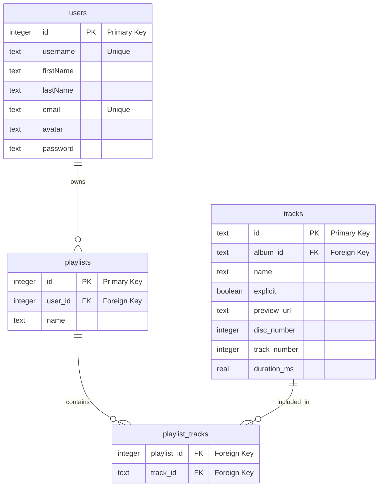

# Contributing

## Day 1

TODO: Add workshop instructions

## Day 2

TODO: Add workshop instructions

## Day 3

There's an important feature we need to get off the ground: playlists.

Write some migrations to create the `playlists` and `playlist_tracks` tables.

Write some seed data to model users creating playlists and adding tracks.
