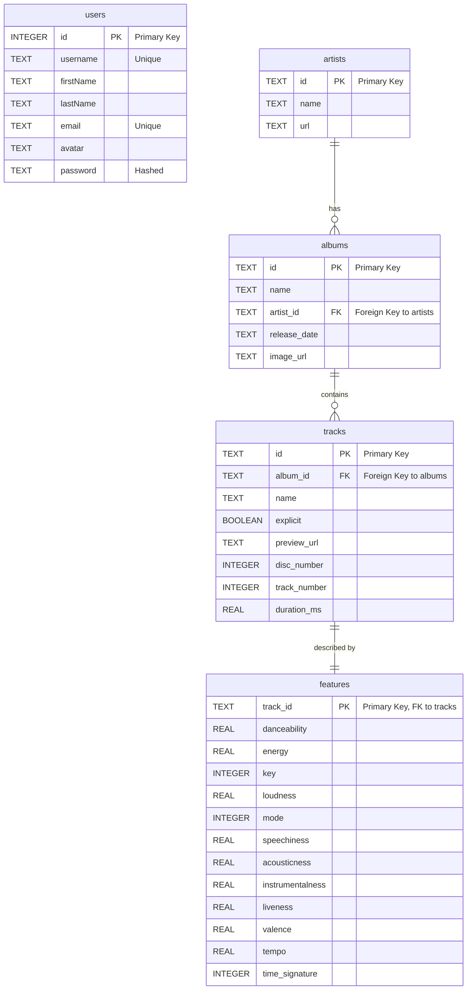

<p align="center">
  
</p>

# Topsify

Welcome to Topsify! We're a huge music streaming service with a global user base
and eye-watering amounts of data.

We're so glad you're here - corporate have been asking for reports, stats and
data, but the team is stretched thin at the moment trying to get the UI right.
Let's get working on the database straight away.

The database is in SQL. Before you tackle the backlog, you should take some time
to get up to speed.

## Getting started

1. First up: fork and clone this repo.

1. The database is already populated, but in case you want to start from
   scratch, this is the command you'll need:

   ```bash
   sqlite3 db/topsify.db < db/reset.sql
   ```

1. Have a look at `queries/example.sql` to see how to query the database.

## Database

Here's a glance at how the database is set up.



## Day 1

### Deep dive

| Reading                                                                                                                                                                   | Exercises             |
| ------------------------------------------------------------------------------------------------------------------------------------------------------------------------- | --------------------- |
| [Select queries](https://tech-docs.corndel.com/sql/select-queries.html) and [Selecting with conditions](https://tech-docs.corndel.com/sql/selecting-with-conditions.html) | `1a.sql` and `1b.sql` |
| [Ordering results](https://tech-docs.corndel.com/sql/ordering-results.html)                                                                                               | `2a.sql` and `2b.sql` |
| [Paginating results](https://tech-docs.corndel.com/sql/limit-offset.html)                                                                                                 | `3a.sql` and `3b.sql` |

### Workshop

With that done, head to CONTRIBUTING.md to see how you can help generating some
reports.

## Day 2

### Deep dive

| Reading                                                                         | Exercises             |
| ------------------------------------------------------------------------------- | --------------------- |
| [Inner joins](https://tech-docs.corndel.com/sql/inner-joins.html)               | `4a.sql` and `4b.sql` |
| [Aggregate queries](https://tech-docs.corndel.com/sql/aggregate-queries.html)   | `5a.sql` and `5b.sql` |
| [Grouped aggregates](https://tech-docs.corndel.com/sql/grouped-aggregates.html) | `6a.sql` and `6b.sql` |

### Workshop

Now you know about join, we can take our reports to the next level. Head to
CONTRIBUTING.md to help!

## Day 3

### Deep dive

| Reading                                                                                                                                                                                            | Exercises             |
| -------------------------------------------------------------------------------------------------------------------------------------------------------------------------------------------------- | --------------------- |
| [Create](https://tech-docs.corndel.com/sql/inserting-rows.html), [update](https://tech-docs.corndel.com/sql/updating-rows.html) and [delete](https://tech-docs.corndel.com/sql/deleting-rows.html) | `7a.sql` and `7b.sql` |
| [Creating tables](https://tech-docs.corndel.com/sql/creating-tables.html)                                                                                                                          | `8a.sql` and `8b.sql` |
| [One-to-many](https://tech-docs.corndel.com/sql/one-to-many.html) and [many-to-many](https://tech-docs.corndel.com/sql/many-to-many.html) relationships                                            | `9a.sql` and `9b.sql` |

### Workshop

We really need the playlists feature out as soon as possible. Take a look at
CONTRBUTING.md to find out how you can help!
