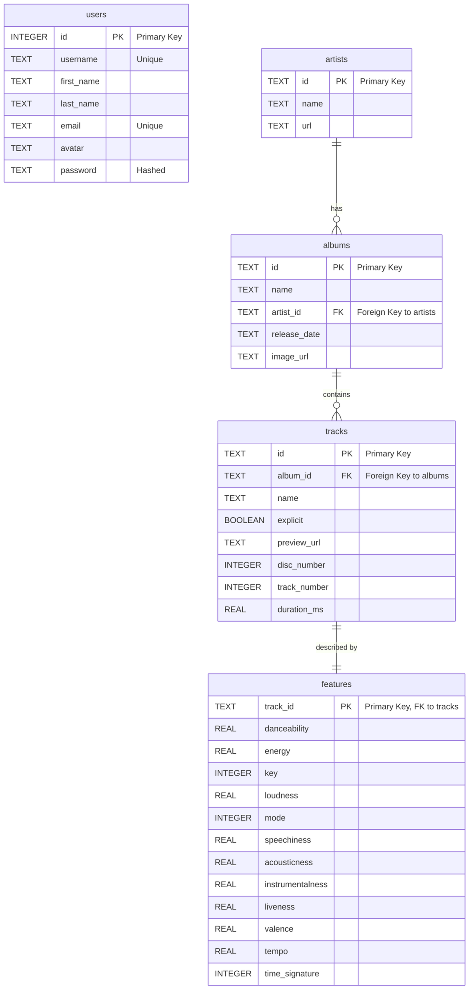

# Contributing

## Website

With the [Live Server extension](vscode:extension/ritwickdey.LiveServer)
installed, you can hit `Ctrl + Shift + P` to open the command palette. Start
typing "live server" and you should see options to start and stop the server.

This should open your browser automatically, but if not, you should be able to
visit (http://127.0.0.1:5500/index.html)[http://127.0.0.1:5500/index.html] in
your browser to see the website.

## Database

If you mess up the database and you want to reset it to its original state, run

```bash
sqlite3 db/db.sqlite < db/reset.sql
```

Be aware that any migrations and seeds you have written will need to be
reapplied in the correct order.

## Creating reports

Open `queries/example.sql` and put the line

```sql
.mode json
```

at the top of the file. This makes `sqlite3` output the results as JSON.

Now, run

```bash
sqlite3 db/db.sqlite < queries/example.sql > reports/example.json
```

and open `reports/example.json`. Your query results are now saved in a JSON
file!

## Schema

Here's a glance at how the database is set up.


