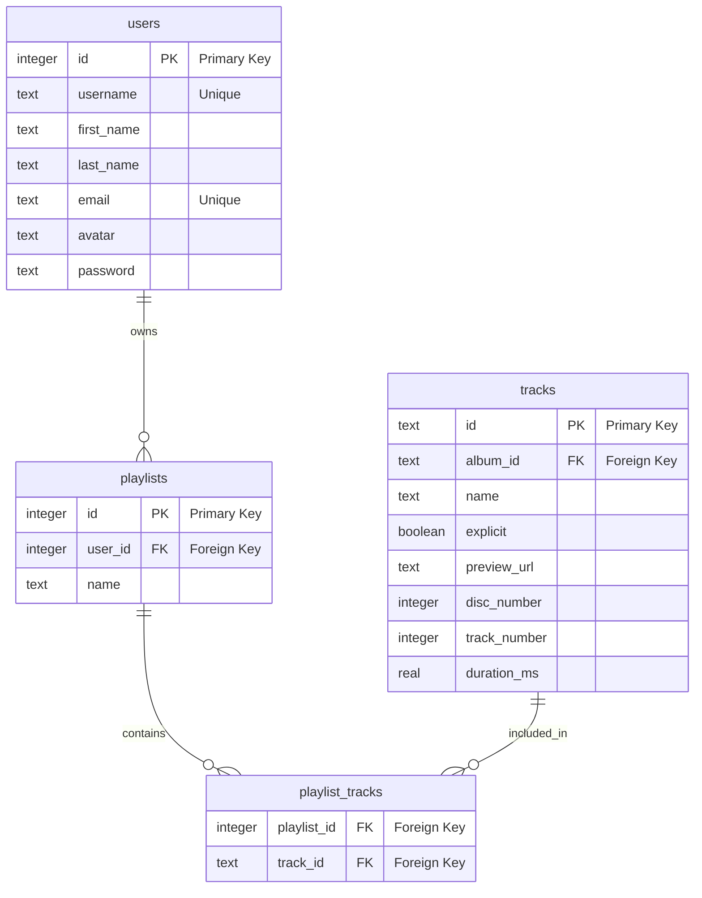

# Day 3 Workshop

There's an important feature we need to get off the ground: playlists.

## Migrations

Write migrations to create the `playlists` and `playlist_tracks` tables.

## Seed data

Write seed data to model users creating playlists and adding tracks to their
playlists.
