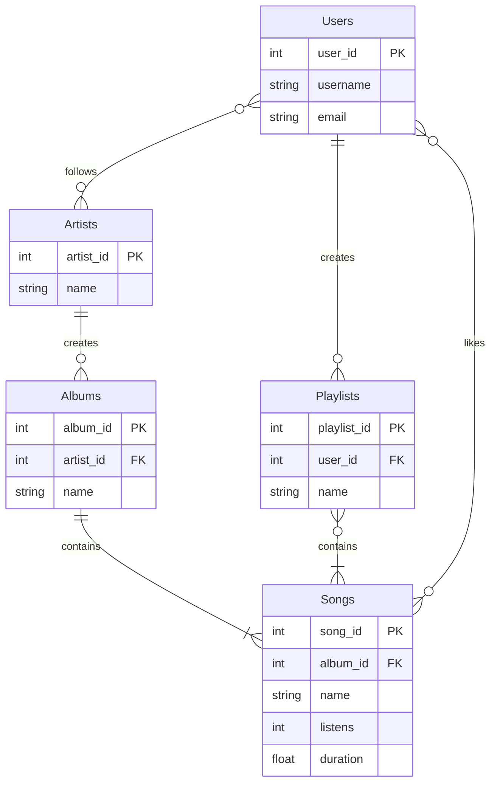

# Exercises

## Basic select queries

```mermaid

erDiagram
  Artists {
    int artist_id PK
    string name
  }

  Albums {
    int album_id PK
    int artist_id FK
    string name
  }

  Songs {
    int song_id PK
    int album_id FK
    string name
    int listens
    float duration
  }

  Users {
    int user_id PK
    string username
    string email
  }

  Playlists {
    int playlist_id PK
    int user_id FK
    string name
  }

  Artists ||--o{ Albums : "creates"
  Albums ||--|{ Songs : "contains"
  Users }o--o{ Artists : "follows"
  Playlists }o--|{ Songs : "contains"
  Users }o--o{ Songs : "likes"
  Users ||--o{ Playlists : "creates"
```
